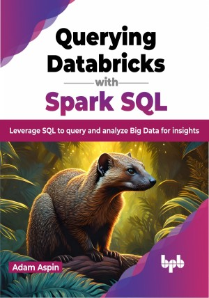

# Querying Databricks with Spark SQL

A practical guide to using Spark SQL to perform complex queries on your Databricks data

This is the repository for [Querying Databricks with Spark SQL
](https://bpbonline.com/products/querying-databricks-with-spark-sql?variant=42914771304648),published by BPB Publications.

## About the Book
Databricks stands out as a widely embraced platform dedicated to the creation of data lakes. Within its framework, it extends support to a specialized version of Structured Query Language (SQL) known as Spark SQL. If you are interested in learning more about how to use Spark SQL to analyze data in a data lake, then this book is for you.

The book covers everything from basic queries to complex data-processing tasks. It begins with an introduction to SQL and Spark. It then covers the basics of SQL, including data types, operators, and clauses. The next few chapters focus on filtering, aggregation, and calculation. Additionally, it covers dates and times, formatting output, and using logic in your queries. It also covers joining tables, subqueries, derived tables, and common table expressions. Additionally, it discusses correlated subqueries, joining and filtering datasets, using SQL in calculations, segmenting and classifying data, rolling analysis, and analyzing data over time. The book concludes with a chapter on advanced data presentation.

By the end of the book, you will be able to use Spark SQL to perform complex data analysis tasks on data lakes.

## What You Will Learn
•  Use Spark SQL to read data from a data lake.

•  Learn how to filter, aggregate, and calculate data using Spark SQL.

•  Learn how to join tables, use subqueries, and create derived tables in Spark SQL.

•  Analyze data over time using Spark SQL to ​track trends and identify patterns in data.

•  Present data in a visually appealing way using Spark SQL.
